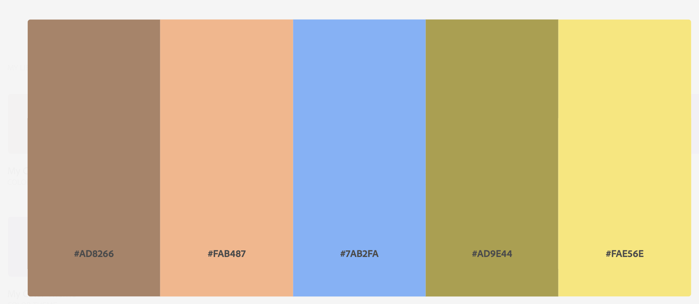

# README

Fatima Attique 

## Project Description

This project serves as my personal portfolio website, showcasing my skills and experiences in web development. As I progress through different sections, I aim to demonstrate proficiency in various technologies and design principles.

### Skills Learned:

- **HTML and CSS:** Building the foundation of the website with responsive design.
- **CSS Animation:** Adding interactivity and visual appeal to elements.
- **GitHub:** Managing version control and collaboration.
- **Netlify:** Deploying and hosting the website.

## Color Scheme

The color scheme is carefully chosen to create a visually appealing and cohesive design:

- **Primary Color (#825d45):** Used for headers and key elements.
- **Accent Color (#FAE56E):** Adds contrast and highlights.

### RGB and Hex Codes:

- **Primary Color (RGB):** 130, 93, 69
- **Primary Color (Hex):** #825d45

- **Accent Color (RGB):** 250, 229, 110
- **Accent Color (Hex):** #FAE56E

## Citations

I have utilized various resources to enhance my understanding and implementation of web development concepts. Here are the key sources:

1. [MDN Web Docs - CSS Animations](https://developer.mozilla.org/en/docs/Web/CSS/CSS_Animations)
2. [CSS Tricks - A Guide to CSS Animation](https://css-tricks.com/snippets/css/keyframe-animation-syntax/)
3. [W3Schools - CSS Animation Property](https://www.w3schools.com/css/css3_animations.asp)

## License

This project is licensed under the [MIT License](LICENSE.md).

---

## Future Enhancements

- Implement a professional logo and favicon.
- Improve the hover effect in the image gallery.
- Optimize media queries for a seamless experience on various devices.

## Contact

Feel free to reach out to me for collaboration or any inquiries. Connect with me on [GitHub](https://github.com/yourusername) and [LinkedIn](https://www.linkedin.com/in/yourlinkedinprofile).

